# velo-toolchain

A CMake toolchain for Windows CE 1.0 and 2.0 MIPS programs and DLLs, aimed at the Philips Velo 1 (Toshiba TX3912, R3910 core). It uses clang and lld, then `tools/mkpe.py` turns the linked ELF into a CE PE.

It can also build the same projects for SH3 Windows CE devices, with an LLVM that has a SuperH backend. See [SH3](#sh3).

## Requirements

macOS:

```sh
brew install llvm lld cmake
```

Debian/Ubuntu:

```sh
sudo apt install clang lld llvm cmake
```

`RESOURCES` also needs `llvm-rc`, which is in both.

Apple's clang has no MIPS backend. The toolchain uses Homebrew's LLVM if present, otherwise the `clang` on `PATH`. Set `VELO_LLVM_ROOT` to use another LLVM install.

## Usage

```cmake
cmake_minimum_required(VERSION 3.20)
project(myapp C)
include(VeloCE)

velo_add_executable(myapp main.c ICON myapp.ico RESOURCES myapp.rc resource.h)
target_link_libraries(myapp PRIVATE velo::commctrl)

velo_add_library(mylib mylib.c EXPORTS Add Greeting=greeting_impl)
```

```sh
cmake -S . -B build -DCMAKE_TOOLCHAIN_FILE=/path/to/velo-toolchain/cmake/velo-ce.cmake -DVELO_CE_VERSION=1
cmake --build build
```

This gives `build/myapp.exe` and `build/mylib.dll`, with the linked `.elf` beside each.

- `velo_add_executable(target [EXCLUDE_FROM_ALL] [OUTPUT file.exe] [ICON file.ico] [RESOURCES files...] sources...)`: entry point `WinMain`.
- `velo_add_library(target [EXCLUDE_FROM_ALL] [OUTPUT file.dll] [RESOURCES files...] EXPORTS name[=symbol]... | EXPORTS_FILE file sources...)`: entry point `DllMain`. `EXPORTS_FILE` has one export per line.
- `RESOURCES`: `.rc` files are compiled with `llvm-rc` and linked into `.rsrc` with the icon. Other files listed (headers, bitmaps) are dependencies. The `.rc` can include `windows.h` and `commctrl.h`. CE has no `DialogBoxParamW`: use `FindResource`, `LoadResource` and `DialogBoxIndirectParamW`.
- `llvm-rc` differs from Microsoft's rc in two ways that matter for SDK samples. It needs the comma after a control's text or name: `LTEXT "Text", -1, 5, 5, 50, 12` and `ICON IDI_APP, IDC_ICON, 5, 5, 32, 32`, where Microsoft's also takes them without. And in a string continued onto the next line with `\`, it keeps the next line's leading spaces, which Microsoft's drops.
- `VELO_CE_VERSION`: `1` (default) or `2`. Sets `_WIN32_WCE` to `100` or `200` and picks the import libraries. SH3 also has `1.01`, see [SH3](#sh3).
- The PE says subsystem 9 (Windows CE GUI) with the CE version, 1.0 or 2.0, as Microsoft's CE 2.0 toolkit writes. CE 2.0 treats a program marked 1.0 as a CE 1.0 program, with another system font for client-area text and other font enumeration results. CE 1.0 runs both the same.
- `VELO_ARCH`: `mips` (default) or `sh3`.
- `CMAKE_BUILD_TYPE` defaults to `MinSizeRel` (`-Os`). `Debug` gives `-O0 -g`.

## Import libraries

`velo::<dll>` links against a DLL in the Velo 1 ROM. `exports/ce1/` and `exports/ce2/` list each DLL's exports, taken from the CE 1.0 and CE 2.0 ROMs. The headers make calling a function the ROM doesn't export a compile error, and one declared some other way fails at link time:

```
ld.lld: error: undefined symbol: GetModuleFileNameW
```

`velo::coredll` is always linked. Others: `commctrl`, `winsock`, and on CE 2.0 `commdlg`, `ole32`, `oleaut32` and `ceshell`. Only the functions a program calls end up in its import table.

Each import library is a set of weak stubs (`lui`/`lw`/`jr` through `__imp_<name>`) with a 4-byte slot per function in `.iat.<DLL>.<name>`, so unused stubs are dropped by `--gc-sections` and a program's own definition of a name overrides the import.

## Headers and runtime

The Win32 headers are CeGCC's w32api (public domain) in `include/w32api`, patched so every constant, structure layout and function signature they share with the Windows CE 1.0 and 2.0 SDKs matches. `include/` wraps them:

- `#include <windows.h>` gives the API as the target CE version has it: `_WIN32_WCE` is `100` or `200`, `UNICODE` is defined, and it brings in the C runtime functions coredll exports (`wchar.h`, `stdlib.h`, `string.h`) and the object store database (`windbase.h`, with both the `Ce` and `Peg` names on both versions). `commctrl.h`, `commdlg.h`, `winsock.h`, `notify.h`, `ras.h`, `msacm.h`, `imm.h`, `tlhelp32.h` and the rest include it.
- Calling a function the target ROM doesn't export is a compile error, e.g. `'GetModuleFileNameW' is unavailable: not in Windows CE 1.0`.
- `STRICT` is on, so each handle type (`HWND`, `HDC`, `HKEY`...) is distinct and mixing them up is a compile error. The SDK leaves it off, so its handles are all `void *` and SDK code can, say, store an `HTREEITEM` in an `HKEY`. Define `NO_STRICT` (`-DNO_STRICT`, or `#define NO_STRICT` before including `windows.h`) to build such code: the handle types are then the SDK's.
- CE exports some wide functions without the `W` (`FindResource`, `GetVersionEx`, `GetClassLong`, the `Ras` and `acm` functions): either name works.
- Every function the ROMs export has a docstring and named parameters, for editor hover and signature help. They're written from the CE 1.0 and 2.0 SDK references, with CE restrictions and the version that has the function.
- `velo::runtime`, always linked: compiler-rt builtins (soft float, 64-bit division), `memcpy`, `memmove`, `memset`, `memcmp`, and `swprintf` and `vswprintf` over coredll's `wsprintfW`. That has no floating point (`%f` prints `f` and misreads the values after it) and writes at most 1023 characters plus the terminating null. Beyond coredll's wide-string functions there is no C library: use `LocalAlloc`, `wsprintfW` and your own maths.
- `windowsx.h` has the SDK's message crackers and control macros. Include it yourself: the CE 1.0 and 2.0 SDKs' `windows.h` don't (CE 1.01's does).
- `tchar.h` has the SDK's generic-text names: `_T`, `_TEXT`, `_tWinMain`, the `_tcs*`, `_ist*` and `_tto*` names on the wide functions coredll exports, and `_stprintf` and `_vstprintf` on `swprintf` and `vswprintf`. `windows.h` includes it on CE 2.0, as the SDK's does. The rest of the SDK's mapping goes to its static C library (`wprintf`, `_snwprintf`, `swscanf`, the stdio functions, `wcstol`, `wcstoul`, `wcstod`), so those are unavailable.

Not covered, so declare them yourself if you need them:

- COM and OLE (`ole32`, `oleaut32` on CE 2.0)
- telephony (`line` and `phone` functions)
- `windowsx.h`'s message crackers, which CE 1.01's `windows.h` includes
- audio codec format IDs (`mmreg.h`), and the ACM filter and format chooser functions
- drivers and kernel internals: PC Card services, device loading, `kfuncs.h` handles
- the address book, mail store and transport APIs
- CE-internal types such as `INT128` and the RAS internals
- ANSI (`A`) structures, which can differ from the SDK's: CE 1.0 and 2.0 have no ANSI functions

`make check-headers` compares the headers with the SDK headers from `tools/fetch-reference` (`VELO_REFERENCE`), including the handle types with `NO_STRICT`. `make headers` regenerates them from a CeGCC checkout's w32api (`VELO_W32API`) and the SDK headers:

- `tools/vendor-w32api.py` copies and patches w32api; `include/w32api/VENDOR.md` lists the patches.
- `tools/mkheaders.py` writes the wrappers, `velo/aliases.h` and `velo/unavailable.h` from `exports/`.
- `tools/mkconstants.py` writes `velo/constants.h` and `velo/types.h`: SDK constants and typedefs w32api lacks.
- `tools/mkdocs.py` (also `make docstrings`) writes the docstrings from `docs/api` above each declaration, and names its parameters.

Both need a clang with the MIPS backend (`CLANG`, default Homebrew's).

## C++

`velo_add_executable` and `velo_add_library` take `.cpp` files too. C++ is compiled as C++20 with the C flags plus `-fno-exceptions -fno-rtti -fno-threadsafe-statics`. `project(myapp C)` is enough: `VeloCE` enables C++ itself.

```cpp
#include <windows.h>

class counter {
public:
    counter() : count(1) {}
    int count;
};

counter global_counter;

int WINAPI WinMain(HINSTANCE instance, HINSTANCE previous, LPWSTR command_line, int show) {
    auto *numbers = new int[4];
    delete[] numbers;
    return global_counter.count;
}
```

- A target that CMake links as C++ (it has a C++ source, or links a C++ static library) gets `velo::cxx_runtime`, and its entry point is `__velo_exe_start` or `__velo_dll_start` instead of `WinMain` or `DllMain`. That runs the global constructors (`.init_array`), calls `WinMain`, then runs the destructors of globals and static locals (`__cxa_atexit`) and `.fini_array`. A DLL runs its constructors on `DLL_PROCESS_ATTACH` before `DllMain`, and its destructors on `DLL_PROCESS_DETACH` after it. C targets don't change.
- Destructors run when `WinMain` returns, not if the program ends some other way.
- The startup costs about 250 bytes, and the exit handlers about 250 more if anything registers one.
- `velo::cxx_runtime` (`runtime/cxx`): `operator new` and `delete` in every form (sized, aligned, `nothrow`, arrays) on `LocalAlloc` and `LocalFree`, `__cxa_atexit`, `__dso_handle`, and `__cxa_pure_virtual`. `new` traps if there's no memory (the `nothrow` forms return NULL), as does calling a pure virtual function.
- The headers' functions have C linkage in C++, and `windows.h` declares `WinMain` and `DllMain`, so define them as in C. Functions a DLL exports need `extern "C"`.
- `include/new` (placement `new`, `std::nothrow`, `std::align_val_t`, `std::launder`) and `include/initializer_list` are the only standard library headers, plus clang's own (`stdint.h`, `stddef.h`, `stdarg.h`, `limits.h`). libc++'s headers aren't usable here: Debian's clang doesn't come with them, and Homebrew's are set up for macOS.
- Not supported: exceptions, RTTI (`dynamic_cast`, `typeid`), `thread_local`, the rest of the standard library, and thread-safe static locals: a static local is initialised by the first thread to reach it, unguarded.
- `make check-cxx-headers` checks every function the headers declare has C linkage in C++, and that the C++ layer compiles for CE 1.0 and 2.0.

### C++ layer

`include/velo/cxx` is a small header-only C++ layer over the API, in namespace `velo`. It aims to cost nothing over the C it replaces, reports errors as values rather than exceptions, and only offers what the target CE version has. See [include/velo/cxx/README.md](include/velo/cxx/README.md).

```cpp
#include <velo/cxx/format.h>
#include <velo/cxx/window.h>

namespace {

class tap_window : public velo::window<tap_window> {
public:
    static constexpr const wchar_t *class_name = L"TapWindow";

    void on_paint(velo::paint_dc &dc) {
        auto text = velo::format<64>(L"Taps: %d", tap_count);
        dc.draw_text(text, client_rect(), DT_CENTER);
    }

    void on_tap(velo::point) {
        tap_count++;
        invalidate();
    }

    void on_destroy() {
        PostQuitMessage(0);
    }

private:
    int tap_count = 0;
};

}
```

`examples/window-cxx` is `examples/window` written with it. Its window looks the same, its source is 51 lines to the C version's 62, and its `.text` is 1,776 bytes to 1,108 (a 7,168 byte `.exe` to 6,656). Of the 668 bytes, about 250 are the C++ startup, 220 come from finding the window's object for each message (the C version uses globals), 130 from checking errors and destroying the window in a destructor, and 60 are three more imports.

## Notes

- CE 1.0 has no `GetModuleFileNameW`, and `LoadLibraryW` doesn't search the program's folder. DLLs normally go in `\Windows`, or pass a full path (see `examples/dll`).
- A DLL's import tables go in a 0x200 byte space before its IAT. `mkpe.py` says if a DLL needs more: `target_link_options(mylib PRIVATE --defsym=VELO_IMPORT_RESERVE=0x400)`.
- `tools/velo-cc` filters clang's "MIPS-I support is experimental" warning. Set `CMAKE_C_COMPILER_LAUNCHER` and `CMAKE_CXX_COMPILER_LAUNCHER` to replace it.

## Debugging

`-DCMAKE_BUILD_TYPE=Debug` builds with `-O0 -g`. The debug info stays in the `.elf`; the `.exe` or `.dll` is the same.

`OutputDebugStringW` output, and the kernel's register dump when a program crashes, show with velo-emu's `--debug-output`. `tools/velo-symbolize` adds functions and source lines to the addresses in it:

```sh
headless rom/nk.bin ... --debug-output 2>&1 | tools/velo-symbolize build/myapp.exe
# debug: AKY=00000003 PC=000110bc [deep crash.c:7] RA=000110ac [deep crash.c:7] BVA=00000000
tools/velo-symbolize build/myapp.exe -a 110bc
```

It reads the `.elf` beside each `.exe` or `.dll` given. A DLL needs the address CE loaded it at: `build/mylib.dll@01f00000`. Addresses in other process slots are matched slot-relative. It uses `llvm-symbolizer`, from `VELO_LLVM_ROOT`, `PATH` or Homebrew's LLVM.

### debugmgr

`debugmgr/` is an agent for velo-emu that copies files and starts and stops programs, much faster than RAPI and without a PPP connection. It talks to the emulator through velo-emu's host mailbox (`break 0x51CE`, see velo-emu's README), so it only runs in the emulator.

```sh
make debug-state  # build/debugmgr/ce*/debug-desktop.state, with debugmgr running
headless rom/nk.bin --load=build/debugmgr/ce1/debug-desktop.state --agent=agent.sock ...
export VELO_AGENT=agent.sock
tools/velo-debug ping
tools/velo-debug put build/ce1/maths/maths.exe /Windows/maths.exe
tools/velo-debug run /Windows/maths.exe     # prints the process ID
tools/velo-debug kill 0x80013f74
```

`make debug-state` needs the same settings as `make test`. It starts debugmgr from a card, copies it to `\Windows`, hands over to that copy and saves the state, so loading it gives a Velo with debugmgr already answering. The card image is kept beside the state as `debug-card.img`, so loading the state finds its card, including a separate CE 2.0 system card. A state only loads on the ROM it was made with: `make debug-state` records that ROM beside each state (`debug-desktop.state.rom`), and `tools/velo-emulator` names it if `VELO_CE2_ROM` (or CE 1.0's `rom/nk.bin`) differs. For CE 2.0, velo-emu's merged ROM (`rom/nk-ce2-merged.bin`) is the easiest: it has the desktop connection software in ROM and needs no system card.

`velo-debug` also has `get`, `ls`, `rm`, `mkdir`, `rmdir`, `mv`, `quit` and `handover` (start another debugmgr, then stop). `kill` only ends programs debugmgr started. The message format is in [debugmgr/PROTOCOL.md](debugmgr/PROTOCOL.md).

velo-emu's GDB stub also uses debugmgr, for `remote put`, `remote get` and `run` after `target extended-remote`. GDB treats `\` as an escape in those paths, so use `/` (`remote put build/ce1/maths/maths.exe /Windows/maths.exe`) or double it. Unix socket paths are limited to about 100 characters, so keep the socket's path short or relative.

Run debugmgr from RAM (`\Windows`) rather than a card: CE loads its code from the EXE as it runs, and a card being remounted after `--load` fails that.

### GDB and VS Code

Each executable gets a GDB script beside its `.elf`, `<name>.elf.gdb`. It loads the symbols, sets the program to run as `\Windows\<name>.exe`, and defines `velo-load`, which uploads the `.exe` and the project's DLLs (all but `EXCLUDE_FROM_ALL` ones) to `\Windows` through debugmgr, where `LoadLibraryW` finds them by name. `tools/velo-emulator --ce 1|2` starts velo-emu from the debug desktop state with its GDB stub on port 2001 (CE 1.0) or 2002 (CE 2.0), or reports one already running there. Add `--headless` for no window.

```sh
tools/velo-emulator --ce 1 &
gdb -x build/myapp.elf.gdb -ex "target extended-remote :2001" -ex "set target-wide-charset UTF-16LE" -ex velo-load -ex "break WinMain" -ex run
```

Set the character set after connecting, since connecting resets it, so `WCHAR` strings show as text.

For VS Code, copy `vscode/launch.json`, `vscode/tasks.json` and `vscode/settings.json` into a project's `.vscode`. The settings have IntelliSense take include paths from CMake Tools. They need:

- the C/C++ and CMake Tools extensions, with the project configured with this toolchain, `CMAKE_BUILD_TYPE=Debug`, and the `VELO_CE_VERSION` that matches the launch configuration you pick
- `gdb` with MIPS support (Homebrew's `gdb` on macOS, `gdb-multiarch` on Linux)
- `VELO_TOOLCHAIN` (this folder), `VELO_EMU`, and for CE 2.0 `VELO_CE2_ROM`, in VS Code's environment
- `make debug-state` run once here

F5 starts the emulator if it isn't running, uploads the selected target's `.exe` and runs it, stopping at breakpoints. The emulator keeps running between sessions.

### OS symbols

For a CE image built with Platform Builder, GDB can also show the kernel's and the system DLLs' functions and source lines. Philips' Velo ROMs have no symbols, so this only applies to self-built images.

Set `VELO_OS_SYMBOLS` to a folder of ELF symbol files for the image, one per module, when configuring the project: `-DVELO_OS_SYMBOLS=folder`, or in the environment, which also covers VS Code. The folder holds:

- `nk.elf`: the kernel, at its run-time addresses
- an ELF for each DLL, at its address in ROM, named as velo-emu's GDB stub reports it: the name in the ROM's module table, with `.elf` for `.dll` (`coredll.elf`)
- `rom.elf`: the kernel and all the DLLs in one file
- optionally `rom.sha256`: the image's SHA-256, as `shasum -a 256` prints it

Make them from the PDBs and map files Platform Builder leaves in the image's release folder. They're derived from Microsoft's binaries, so keep them out of anything you publish.

With it set, the `.gdb` scripts load `nk.elf` and add the folder to the shared-library search path after the project's folders, and `velo-load` runs `sharedlibrary`, so GDB reads each system DLL's symbols as the stub reports it. The stub names a DLL as the program loaded it, so a file in the folder whose name only differs in case is loaded too. If no system DLL has been read by the first stop, because the stub has no module list, they replace `nk.elf` with `rom.elf`, which works as ROM DLLs don't move. That needs GDB with Python. Source lines name files on the machine the image was built on, so GDB shows the line number without the text. Without the setting, the scripts are unchanged.

`tools/velo-symbolize --os FOLDER` looks up kernel and ROM DLL addresses in `rom.elf`, after the modules given. `tools/velo-emulator` warns when `VELO_OS_SYMBOLS` in its environment has a `rom.sha256` for another ROM.

To debug on a self-built CE 2.x image, set `VELO_CE2_ROM` to it and `VELO_CE2_STATE` to a desktop state saved with it, and run `make debug-state`.

`vscode/rc-language` is a VS Code extension that highlights resource scripts (`.rc`). Its README says how to install it.

## SH3

`-DVELO_ARCH=sh3` builds for SH3 Windows CE devices. It needs an LLVM with a SuperH backend and Windows CE's SH-3 calling convention (the `sh3el-unknown-none-wince` triple), which LLVM releases don't have: set `VELO_LLVM_ROOT` to one, built from llvm/llvm-project#181287 with CE support added.

```sh
cmake -S . -B build-sh3 -DCMAKE_TOOLCHAIN_FILE=/path/to/velo-toolchain/cmake/velo-ce.cmake -DVELO_CE_VERSION=1 -DVELO_ARCH=sh3 -DVELO_LLVM_ROOT=/path/to/llvm
```

What changes:

- clang targets `sh3el-unknown-none-wince`, and `SHx`, `SH3` and `_SH3_` are defined, as the SDK's SH3 projects do, for C and `.rc` files. The headers define them too if the compiler is SuperH, and `MIPS` and `_MIPS_` otherwise.
- `CONTEXT` is CE's SH3 layout: `TEA`, `Expevt` and `Trapa` after `Psr`, then the debug registers in a union with CE 1.0's `hProc`, `akyCur` and `oldR15`, or CE 2.0's `oldR15` and `pFpuData`.
- Import stubs load `__imp_<name>` from a literal after the stub and `jmp @r0`, as Microsoft's SH3 import libraries do.
- `mkpe.py` writes machine 0x1A2 when the ELF is SuperH, and `R_SH_DIR32` relocations become HIGHLOW base relocations. PC-relative ones need none.
- `velo_runtime` adds the 32-bit division builtins, since the SH3 has no divide instruction.

The import libraries come from `exports/ce1-sh3` and `exports/ce2-sh3`: the SH3 import libraries in Microsoft's CE 1.0 and 2.0 SDKs, not a device's ROM. `tools/mkexports.py` reads them out of the SDK's `.lib` files, which `tools/fetch-reference` downloads to `lib/`:

```sh
python3 tools/mkexports.py $VELO_REFERENCE/lib/ce100/sh3/*.lib --output exports/ce1-sh3
```

The C runtime DLL's libraries (`msvcrt.lib`, `msvcrtd.lib`) are left out: that DLL isn't in ROM. Compared with the MIPS lists:

- coredll is the same as the MIPS SDK's, plus `DebugBreak`. The MIPS SDK lists match the Velo's `exports/ce1` and `exports/ce2` coredll, commctrl and winsock exactly.
- There are lists for the SDK's other DLLs: on CE 1.0 addrstor, htmlview, msgstore, pcmcia and pmemtool, and on CE 2.0 also atlce, hwxusa, inkx, ndis, toolhelp and wininet. The Velo's ROM-only DLLs aren't there.
- `VELO_CE_VERSION=1.01` targets CE 1.01, the Handheld PC update with localisation support: `_WIN32_WCE` is `101`, `INTERNATIONAL` is defined as the SDK's `windows.h` does, and the import libraries are CE 1.01's (`exports/ce101-sh3`), whose coredll adds 276 functions to CE 1.0's and drops 5. The headers add CE 1.01's constants and `CONTEXT`'s `pFpuData`.

`make examples-sh3` builds the examples into `build/ce1-sh3`, `build/ce101-sh3` and `build/ce2-sh3`, with `VELO_SH3_LLVM` as the LLVM. `make check-headers-sh3` compares the headers with the SDK headers using its SH3 defines. Without `VELO_SH3_LLVM` it compiles for MIPS instead (`--target-arch mips`), which checks the SH3 declarations but not the SuperH ABI's layouts. `long long` and `double` are 8-byte aligned in structures, as the SH compiler's default `/Zp8` gives.

`make debugmgr-sh3` builds debugmgr for SH3. It calls the host through `trapa #0xCE`, which the SH3 emulator (a velo-emu fork for Microsoft's Odo SH3 reference board, running a Platform Builder 2.11 CE image) answers like velo-emu's mailbox, so `velo-debug` works with it. The examples run there, from a folder served with its `--folder` or copied over with `velo-debug`; the CE 1.0 and CE 2.0 builds look the same:

| `hello` | `window` | `maths` | `dll` |
| --- | --- | --- | --- |
|  | 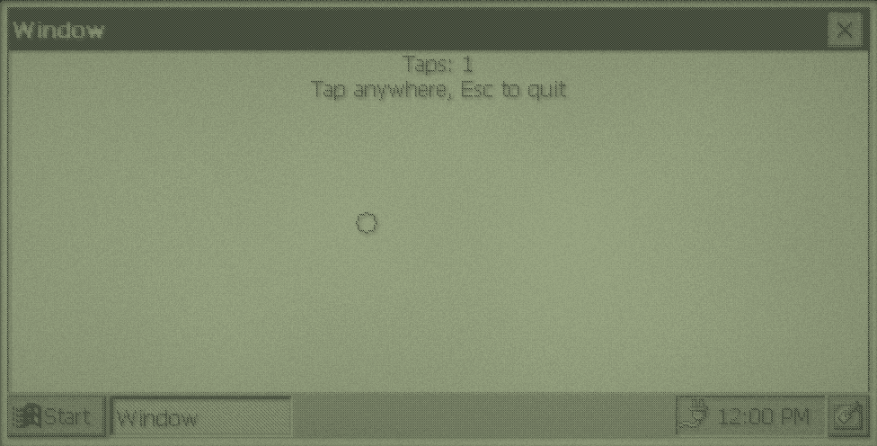 | 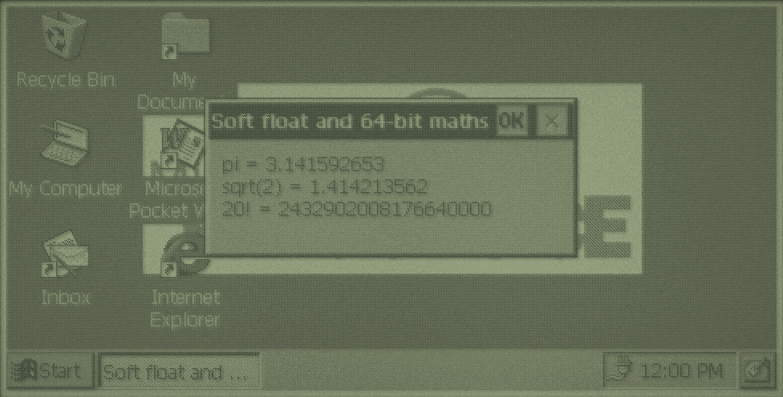 | 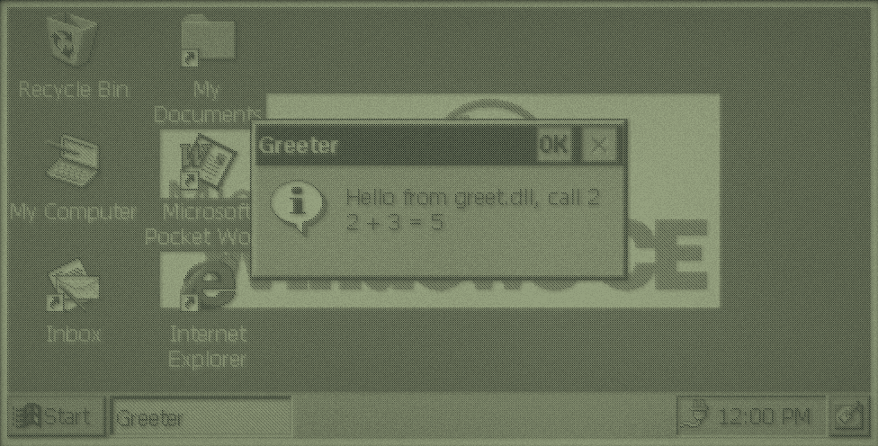 |

Not on SH3 yet: `make debug-state`, `tools/velo-emulator`, the GDB scripts and VS Code setup, and `make test` are written for velo-emu and the Velo. `velo-symbolize` works on SH3 builds. Programs have no `.pdata`, so CE can't unwind them for structured exception handling, as on MIPS.

## Reference material

`tools/fetch-reference FOLDER` (or `$VELO_REFERENCE`) downloads the Windows CE 1.0, 1.01 and 2.0 SDK headers, the SDKs' MIPS and SH3 libraries, the CE 2.0 toolkit's Win32 samples and the toolkits' documentation (InfoViewer `.ivt` titles, including the CE 1.0 and 2.0 SDK references and the PR3910 processor reference) from archive.org, and extracts the titles to HTML with `tools/extract-ivt`. They're Microsoft's, for reference only.

## Examples and tests

`examples/` has `hello` (message box), `window` (window, painting, taps, icon), `maths` (soft float and 64-bit integers), `dll` (a DLL and a program that loads it), `cxx-basics` (C++: constructors, destructors, virtual functions, `new`, templates and lambdas, and a C++ DLL) and `window-cxx` (`window` with the C++ layer).

`docs/primer/index.html` is a beginner's guide to writing Velo programs with this toolchain. Its examples are in `docs/primer/examples`: `make primer` builds them, and `make primer-screenshots` updates its screenshots, with the same settings as `make test`. Its pages are built from `docs/primer/src` with `python3 docs/primer/src/build.py`, which copies code listings from the examples, the headers' types and the export lists into the HTML, and needs a velo-bluesky checkout beside this one. `--og` also renders the link preview image, `og.png`, with Chrome. Link metadata uses `PRIMER_URL` (default `https://gadgetoid.github.io/velo-toolchain/`), where the primer is published.

```sh
make examples   # build for CE 1.0 and CE 2.0 into build/ce1 and build/ce2
make test       # also run each example in velo-emu, screenshots in build/ce*/screenshots
make screenshots  # update the screenshots below, in docs/screenshots
```

`make test` and `make screenshots` need these set:

- `VELO_EMU`: a built velo-emu checkout
- `VELO_APPS`: a velo-apps checkout, for the desktop states in `tools/`
- `VELO_CE2_ROM`: the CE 2.0 `nk.bin`, or velo-emu's merged image (CE 2.0 only)
- `VELO_CE2_SYSTEM_CARD`: the CE 2.0 `ce2_sys.img`, if the ROM isn't merged
- `VELO_CE2_STATE`: a CE 2.0 desktop state, if not velo-apps' `clean-desktop-ce2.state` (which needs the separate ROM and system card)

On Linux they also need `dosfstools` and `mtools`. `make screenshots` also needs `pngquant`.

Other projects can use `tests/emulator.py` for their own programs: import it, set `ARGUMENTS` and `NETWORK_SETTLE_SECONDS`, and call `main()`, as velo-bluesky does. Programs in `NETWORK_SETTLE_SECONDS` get the PPP network and web proxy, are started over RAPI (`velo-rapi run`) once the Velo is online, and are screenshotted after that many seconds of real time. If the Velo doesn't answer over RAPI, as with the separate CE 2.0 ROM and system card, they're started from the Run dialog instead.

| | CE 1.0 | CE 2.0 |
| --- | --- | --- |
| `hello` | 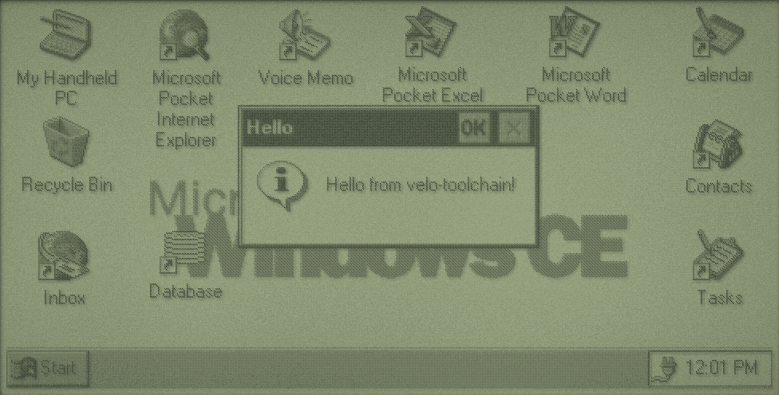 | 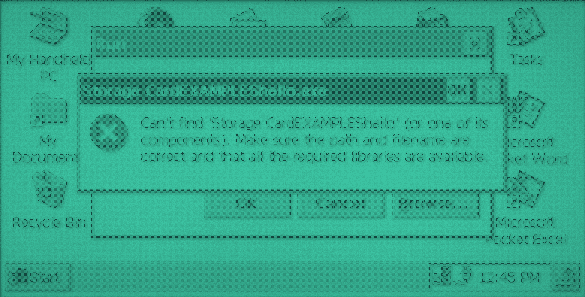 |
| `window` | 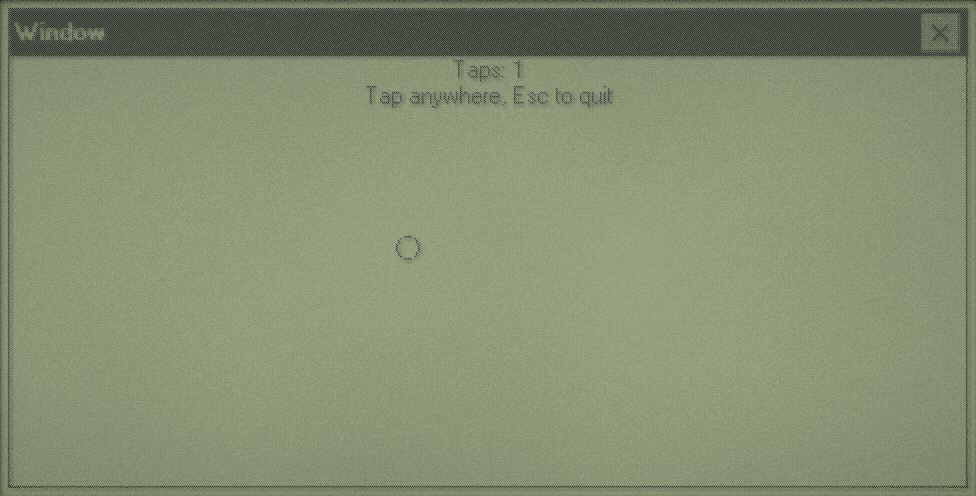 | 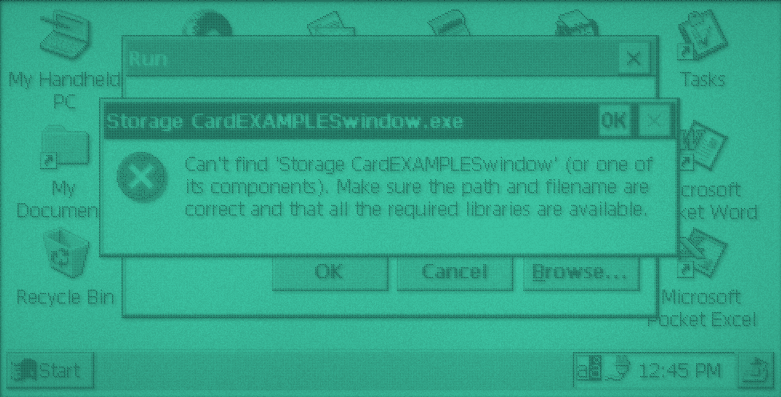 |
| `maths` | 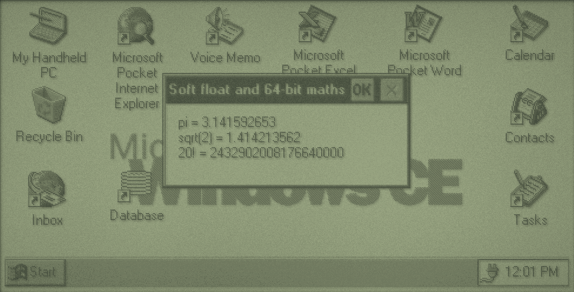 | 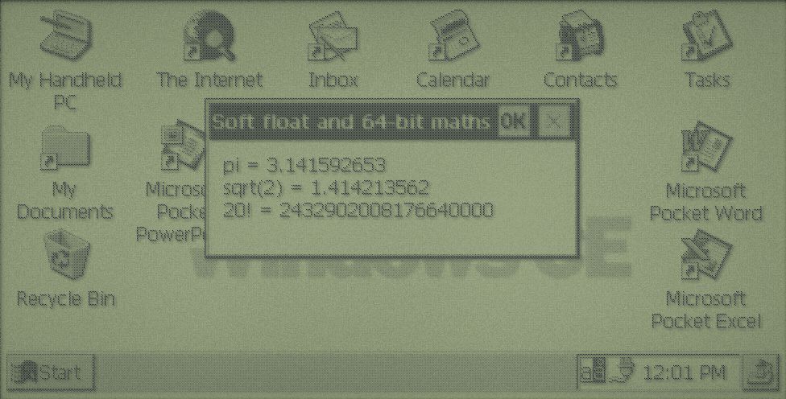 |
| `dll` | 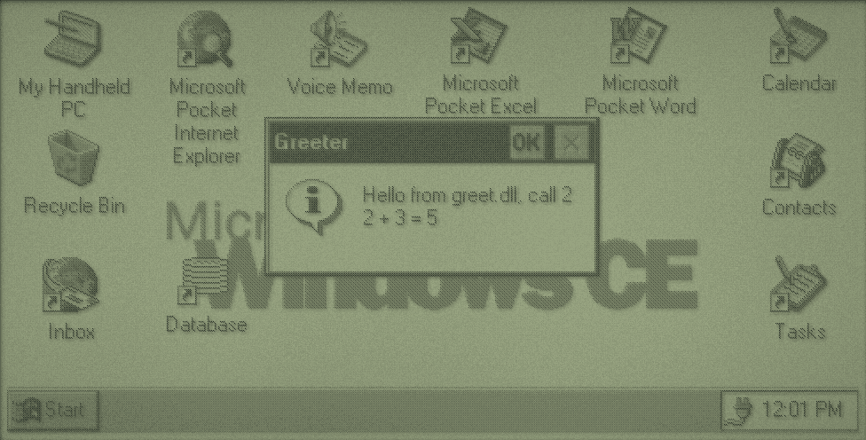 | 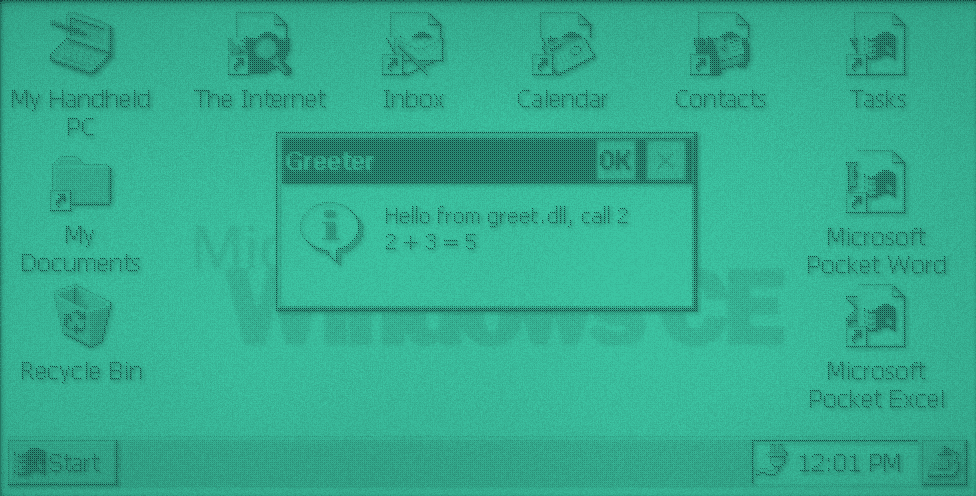 |

## Sources

- `tools/mkpe.py` and the linker scripts: from velo-apps' installer build, extended for imports from more than one DLL.
- `include/w32api/`: CeGCC's w32api headers (from MinGW), public domain, see `include/w32api/README.w32api`. `include/w32api/VENDOR.md` lists our patches.
- `include/velo/constants.h` and `types.h`: values and types from the Windows CE 1.0 and 2.0 SDK headers (`tools/fetch-reference`).
- `docs/api`: docstrings written in our own words from the Windows CE 1.0 and 2.0 SDK references.
- `exports/ce1`, `exports/ce2`: from velo-apps' ROM export tables (`tools/velo1_rom_exports.json`, `tools/velo1_ce2_*_exports.tsv`).
- `exports/ce1-sh3`, `exports/ce101-sh3`, `exports/ce2-sh3`: function names from the CE 1.0, 1.01 and 2.0 SDKs' SH3 import libraries (`tools/mkexports.py`).
- `runtime/compiler-rt/`: LLVM compiler-rt builtins, Apache 2.0 with LLVM exceptions, see `runtime/compiler-rt/LICENSE.TXT`.

## Licence

MIT, see `LICENSE`. Bundled third-party code keeps its own licence, as listed under Sources.
